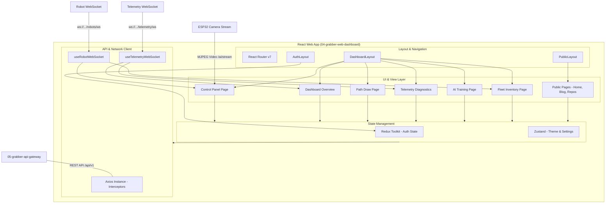

# 🖥️ Grabber Web Dashboard

> **Repository `04`** · Premium React/Vite-based web client for teleoperating the Grabber 4DOF robotic arm — featuring real-time virtual joystick controls, canvas-based kinematic path planners, live vision tracking overlays, 3D digital twins, and AI task orchestrations.

[]()
[-F7DF1E?logo=javascript&style=flat-square)]()
[]()
[]()
[]()
[]()


## 🎥 Video Demonstration

<div align="center">
  <a href="https://youtu.be/NcwvMj28dTk?si=NOJdQf--oYl_QjBU">
    
  </a>
  <br/>
  <sub>Click the image above to watch the demonstration video on YouTube.</sub>
</div>

---


## 🧭 System Architecture

The Web Dashboard serves as the central operator console. It communicates with the system API Gateway to orchestrate robotic commands, ingest live telemetry streams, render canvas paths, and toggle computer vision models.



---

## 📂 Project Structure

The project code is modularized into distinct directories handling UI routing, layouts, stores, components, and custom hooks:

```
src/
├── api/
│   └── axiosInstance.js       # Centralized Axios setup with JWT header interceptors
├── assets/                    # Shared image resources and logos
├── components/
│   ├── ui/                    # Reusable premium widgets (PopupDialog, NoRobotsLock)
│   ├── Footer.jsx             # Footers with social icons and relative site links
│   ├── Mermaid.jsx            # Dynamic client-side Markdown Mermaid compiler
│   ├── Navbar.jsx             # Public navigation containing light/dark theme switches
│   └── ScrollToTop.jsx        # Routing utility resets view scroll on redirect
├── data/
│   ├── blog/                  # Markdown-based engineering, hardware, and AI logs
│   └── timelineData.js        # Timeline schemas for features pages
├── hooks/
│   ├── useRobotWebSocket.js   # Live web socket connection to '/robots/ws'
│   └── useTelemetryWebSocket.js # Live web socket connection to '/telemetry/ws'
├── layouts/
│   ├── AuthLayout.jsx         # Card alignment layout for login/signup
│   ├── DashboardLayout.jsx    # Sidebar drawer layout protecting dashboard pages
│   └── PublicLayout.jsx       # Standard wrapper with Navbar and Footer
├── pages/
│   ├── auth/                  # Registration, Login, OTP, and password recovery views
│   ├── public/                # Marketing/landing pages (HomePage, Features, Gallery)
│   └── dashboard/             # Protected pages for controlling the robotic arm
│       ├── ai-tabs/           # Tab sub-views (Gestures, Speech, Pick&Place, Sorting)
│       ├── AITrainingPage.jsx # AI Task hub managing computer vision workflows
│       ├── ControlPanelPage.jsx # Joystick HUD, poses, sequences, and camera player
│       ├── DashboardPage.jsx  # Overview metrics, health gauges, and notifications
│       ├── DeviceRegistrationPage.jsx # Pairing physical assets using Serial Hex IDs
│       ├── MediaGalleryPage.jsx # Photo/video captures view with download actions
│       ├── PathDrawPage.jsx   # Coordinate-based canvas path waypoint planner
│       └── TelemetryPage.jsx  # System diagnostic charts and joint posture radars
├── store/
│   ├── slices/
│   │   └── authSlice.js       # Redux slice mapping login actions and profile status
│   └── store.js               # Redux store config registering authSlice reducers
├── utils/
│   └── blogData.js            # Utility aggregator parsing local blog articles
├── App.css                    # Structural base overrides
├── App.jsx                    # Root routes mapping using React Router DOM
├── index.css                  # Tailwinds directives and glassmorphic layout tokens
└── main.jsx                   # Entry point booting React DOM and Redux Store
```

---

## 🎛️ Feature Overview

### 1. Teleoperation HUD (Control Panel)
* **Dual Virtual Joysticks**:
  * *Joystick 1*: Deflects coordinates mapping to **Base (J1)** and **Shoulder (J2)**.
  * *Joystick 2*: Deflects coordinates mapping to **Elbow (J3)** and **Gripper (J4)**.
* **Speed Limiter**: Custom slider sets coordinate step multipliers on deflection ticks (150ms loop).
* **Poses & Sequences**: 
  * Record individual coordinates as a named **Pose** (`POST /poses`) and execute later.
  * Record sequence timelines (`POST /sequences`) to play back joint motions sequentially.
* **Vision Integration**: Streams MJPEG video feeds from the ESP32-CAM. Operators can toggle fullscreen or trigger snapshots/live recording.

### 2. Live Telemetry Diagnostics (Recharts Panels)
The Telemetry page connects to `ws://{host}:8000/api/v1/telemetry/ws` to render real-time graphs:
* **Circular HUD Gauges**: Real-time readouts for battery capacity, current draw, voltage sag, and joint degrees.
* **Power Dynamics (Area Chart)**: Tracks power in milliwatts (mW) and current in milliamperes (mA) against motion activity.
* **Posture Signature (Radar Chart)**: Spatially maps J1–J4 degrees relative to coordinate limits (0° to 180°).
* **Kinematic Synchronization (Line Chart)**: Plot curves illustrating joint paths over time.
* **Battery Sag Profile (Scatter Plot)**: Scatter-maps voltage drops against momentary current spikes.

### 3. Kinematic Path Planning (Canvas Workspace)
* **Coordinate Painter**: Provides a grid canvas workspace where operators click to drop coordinate waypoints.
* **Node Inspector**: Lists coordinates for each node (X/Y) with options to clear points, export JSON files, or send commands to execute paths sequentially.

### 4. AI Task Orchestration (AITraining)
A tabbed hub to coordinate computer vision tasks and model training configurations:
* **Control Center**: Connects to the backend AI agent to monitor running models, accuracies, and system latencies. Features a global **Start All** or **Stop All** switch.
* **Gesture Control**: Leverages local webcams to capture hand movements at 150ms intervals. Frames are submitted to `POST /ai/gesture/recognize` to extract joint actions (e.g. Fist -> Close Gripper).
* **Voice Commands**: Captures speech using the Web Speech API, with fallback to offline local chunk recording submitted to `POST /ai/voice/transcribe`.
* **Face Recognition**: Displays logs of authorized vs unknown operators. Features an enrollment wizard to register new faces via image upload.
* **Pick & Place**: Configures target coordinates and grasp forces (Low, Medium, High) for automated sorting tasks.

### 5. Fleet Inventory Management (Device Registration)
Pairs physical Grabber robotic arms with user profiles:
* **Authorization credentials**: Registers devices using a **Robot ID** and **Hardware Serial Key**.
* **Live Status Sync**: Maintains WebSocket listeners to update firmware versions and connection status (Active/Offline) on event triggers.

---

## ⚡ API Integration & WebSockets

The web application integrates with backend services through the **Axios Client** and custom WebSocket hooks:

### 1. Centralized HTTP API Client (`src/api/axiosInstance.js`)
* **Base URL**: Defaults to `http://localhost:8000/api/v1` (configurable via `VITE_API_URL`).
* **Interceptors**: Automatically retrieves the user's JWT from secure store and attaches it to request headers (`Authorization: Bearer <token>`). Automatically routes users to `/auth/login` on `401 Unauthorized` responses.

### 2. Telemetry WebSocket Hook (`src/hooks/useTelemetryWebSocket.js`)
* **Path**: `ws://{hostname}:8000/api/v1/telemetry/ws`
* **Handler**: Ingests updates where `data.type === 'telemetry'` to feed live recharts graphs.

### 3. Robot Status WebSocket Hook (`src/hooks/useRobotWebSocket.js`)
* **Path**: `ws://{hostname}:8000/api/v1/robots/ws`
* **Handler**: Manages automatic 3-second reconnection timeouts to keep fleet lists and control panels updated with the latest robot status.

---

## 🛠️ Technology Stack & Dependencies

The application runs on React 19 and utilizes several specialized libraries:

### Core Libraries
* **`react` & `react-dom`** (`v19`): Standard rendering engine.
* **`react-router-dom`** (`v7`): Handles layout routing and route guards.
* **`vite`** (`v8`): Build tool and development server.

### State & Networking
* **`@reduxjs/toolkit`** (`v2`) & **`react-redux`** (`v9`): Manages authentication and user sessions.
* **`zustand`** (`v5`): Lightweight state store handling themes (light/dark mode).
* **`axios`** (`v1`): HTTP network client.

### UI, Charts & Animation
* **`recharts`** (`v3`): Charting library for telemetry plots.
* **`three`** (`v0.184.0`): Three.js library for 3D digital twins.
* **`gsap`** (`v3`): Animation library for page and card transitions.
* **`tailwindcss`** (`v3`): CSS styling framework.
* **`lucide-react`** (`v1`): Consistent modern icons.
* **`mermaid`** (`v11`): Local parser for architecture diagrams.

---

## 🚀 Getting Started

### Prerequisites
* **Node.js**: `^18.x` or higher
* **npm**: `^9.x` or higher
* **API Gateway Host**: A running backend gateway service (see links below)

### Installation
1. **Clone the repository**:
   ```bash
   git clone https://github.com/thathsarabandara/04-grabber-web-dashboard.git
   cd 04-grabber-web-dashboard
   ```

2. **Install node dependencies**:
   ```bash
   npm install
   ```

3. **Configure Environment Variables**:
   Create a `.env` file in the root directory:
   ```env
   VITE_API_URL=http://<your-gateway-ip>:8000/api/v1
   ```

4. **Run Development Server**:
   ```bash
   npm run dev
   # Open browser: http://localhost:5173
   ```

5. **Build for Production**:
   ```bash
   # Compiles distribution bundle inside dist/
   npm run build

   # Preview compiled production build locally
   npm run preview
   ```

---

## 🔗 Related Grabber Repositories

| Repository | Purpose |
|---|---|
| [`01-grabber-architecture`](https://github.com/thathsarabandara/01-grabber-architecture) | System designs, specifications, and central schemas |
| [`02-grabber-firmware`](https://github.com/thathsarabandara/02-grabber-firmware) | ESP32 kinematics controls and camera stream servers |
| [`03-grabber-mobile-app`](https://github.com/thathsarabandara/03-grabber-mobile-app) | Flutter mobile application featuring local BLE teleoperation |
| [`05-grabber-api-gateway`](https://github.com/thathsarabandara/05-grabber-api-gateway) | Inbound router proxying REST & WebSocket connections |
| [`06-grabber-auth-service`](https://github.com/thathsarabandara/06-grabber-auth-service) | Service managing user profiles, avatars, and JWT security |
| [`07-grabber-robot-service`](https://github.com/thathsarabandara/07-grabber-robot-service) | Service scheduling joint movement commands and homing routines |
| [`08-grabber-telemetry-service`](https://github.com/thathsarabandara/08-grabber-telemetry-service) | Service publishing real-time diagnostics and vision captures |
| [`09-grabber-ai-service`](https://github.com/thathsarabandara/09-grabber-ai-service) | Core service managing voice transcripts and gesture controls |

---

<div align="center">
  <sub>Part of the <strong>Grabber</strong> AI-Powered Industrial Robotic Arm Platform</sub>
</div>
